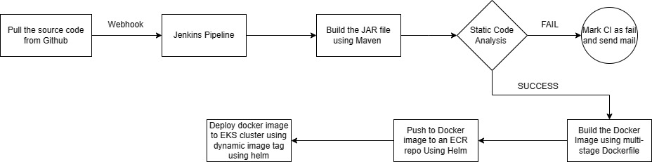

# This repository contains the deployment of a Spring Boot Application on EKS using Jenkins, Helm, Docker, Amazon ECR and AWS EKS.

## Prerequisites

Ensure you have the following prerequisites set up before proceeding with the deployment:

- **EKS Cluster Setup**: Have an Amazon EKS (Elastic Kubernetes Service) cluster ready.
- **ECR Repo**: Create an Amazon ECR (Elastic Container Registry) repository to store Docker images.
- **AWS CLI installed**: Install AWS CLI (Command Line Interface) and configure it with your AWS credentials.
- **Helm installed**: Install Helm, the Kubernetes package manager.
- **kubectl and eksctl installed**: Install kubectl and eksctl for interacting with your EKS cluster.
- **Spring Boot app setup**: Have your Spring Boot application ready for deployment.

## Implementation Steps

Follow these steps to deploy your Spring Boot application on AWS EKS using Jenkins, Helm, Docker, and Amazon ECR:

1. **Create EKS cluster**: Use eksctl command to create an EKS cluster.

2. **Create ECR repository**: Set up an Amazon ECR repository to store your Docker images.

3. **Create namespace for Helm deployment**: Create a Kubernetes namespace dedicated to your application deployment.

4. **Create Helm chart**: Develop a Helm chart to manage the deployment of your Spring Boot application.

5. **Modify Helm values**: Update values in the Helm charts to specify the Docker image repository and tag.

6. **Configure Jenkins credentials**: Set up appropriate credentials in Jenkins to integrate with Git, SonarQube, and Kubernetes cluster.

7. **Install Jenkins and create pipeline**: Install Jenkins and create a Jenkins pipeline with the following stages:
    - Clone the Git repository.
    - Build the Spring Boot application JAR file.
    - Perform static code analysis using SonarQube.
    - Build Docker image for the application.
    - Tag the Docker image and push it to ECR repository.
    - Deploy to EKS using Helm with dynamic Docker image tag.

8. **Verify deployments**: Check deployments in the Kubernetes namespace on the EKS cluster.

9. **Access the application**: Access your Spring Boot application in the browser.

## Contributing

Contributions are welcome! If you have any suggestions, improvements, or feature requests, please open an issue or create a pull request.
